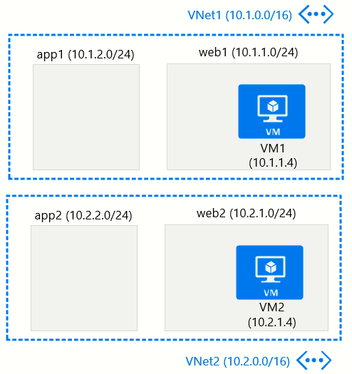
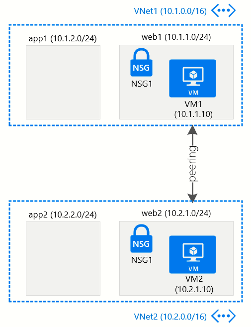
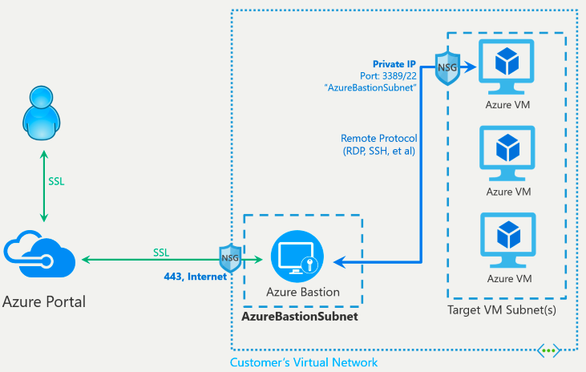

# Getting the Hang of Azure Networking

## Nashville Microsoft Azure Users Group

### Meta

* [User group meeting page](https://www.meetup.com/__ms183141645/The-Nashville-Microsoft-Azure-Users-Group/events/262535815/?rv=md1&_xtd=gatlbWFpbF9jbGlja9oAJGNlN2RmOGExLWVmNWYtNDYyOS1iYzkxLTc4YzY1MjlhYjYwZg&_af=event&_af_eid=262535815&expires=1563559795583&sig=6c483b96e59b15b8100d62da317ffd39e3d3f4fe)
* [Tim's repo](https://github.com/timothywarner/summer2019) (http://timw.info/summer2019)

### Contact Info

* Tim Warner
  * [Twitter](https://twitter.com/techtrainertim)
  * [Website](https://techtrainertim.com/)
  * [Pluralsight author page](https://www.pluralsight.com/authors/tim-warner)

### Topology Diagrams

We'll build these environments tonight.

#### Before

#### After, Part 1

#### After, Part 2

### For Further Learning

* [Azure Networking](https://docs.microsoft.com/en-us/azure/networking/networking-overview)
* [Azure Security Groups](https://docs.microsoft.com/en-us/azure/virtual-network/security-overview)
* [Azure Network Security](https://docs.microsoft.com/en-us/azure/security/security-network-overview)
* [Azure Bastion](https://docs.microsoft.com/en-us/azure/bastion/bastion-overview)

